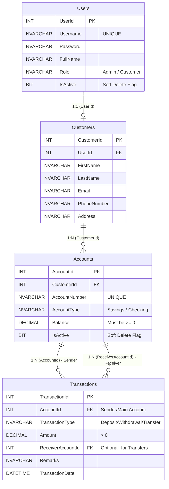

# Week 2 Task: Database Design Document

## 1. Introduction
This document outlines the comprehensive database design for the **Banking Transaction System**. The database is designed to securely handle user authentication, customer profiles, account management, and transaction tracking. The implementation is done using Microsoft SQL Server and adheres strictly to robust banking constraints (including soft-deletes, double-entry audit ledgers, and transaction atomicity).

## 2. Entity-Relationship Diagram (ERD)

## 3. Tables & Relationships
The database consists of 4 main tables:

### Users Table
- **Purpose**: Manages system authentication, authorization, and soft-delete capabilities.
- **Primary Key**: `UserId`
- **Logic**: Stores username, password, full name, role (`Admin` or `Customer`), and an `IsActive` flag.
- **Constraints**: 
  - `Username` is `UNIQUE` and `NOT NULL`.
  - `Role` has a `CHECK` constraint to only allow 'Admin' or 'Customer'.
  - `IsActive` defaults to `1` (True).

### Customers Table
- **Purpose**: Stores detailed profile information and contact details for customers.
- **Primary Key**: `CustomerId`
- **Foreign Key**: `UserId` referencing `Users(UserId)`.
- **Logic**: Holds strictly required personal details: FirstName, LastName, Email, PhoneNumber, and Address. 

### Accounts Table
- **Purpose**: Stores bank account details and ledger balances for customers.
- **Primary Key**: `AccountId`
- **Foreign Key**: `CustomerId` referencing `Customers(CustomerId)`.
- **Logic**: Tracks the auto-generated account number, type (Savings/Checking), the current exact balance, and an `IsActive` flag to support administrative soft-deletes.
- **Constraints**:
  - `AccountNumber` is `UNIQUE`.
  - `AccountType` has a `CHECK` constraint ('Savings' or 'Checking').

### Transactions Table
- **Purpose**: Maintains a permanent, undeletable history of all financial transactions acting as an immutable audit trail.
- **Primary Key**: `TransactionId`
- **Foreign Keys**: 
  - `AccountId` referencing `Accounts(AccountId)` (Primary Account / Sender).
  - `ReceiverAccountId` referencing `Accounts(AccountId)` (Target Receiver, nullable).
- **Logic**: Records the transaction type, exact amount, date, and any remarks provided by the user.
- **Constraints**: 
  - `TransactionType` has a `CHECK` constraint ('Deposit', 'Withdrawal', 'Transfer').

---

## 4. Stored Procedures
We have implemented fully transactional stored procedures to encapsulate business logic, prevent SQL injection, and guarantee data atomicity:
- **`sp_UserLogin`**: Validates user credentials and ensures the user account `IsActive = 1`.
- **`sp_CreateUser`**: Handles administrative and customer registration. It safely inserts data into both `Users` and `Customers` tables using `BEGIN TRANSACTION` and `COMMIT` to ensure both records are linked seamlessly.
- **`sp_CreateAccount`**: Generates a new bank account tied to a specific customer profile.
- **`sp_DepositMoney` & `sp_WithdrawMoney`**: Handles deposits and withdrawals while ensuring sufficient balance exists prior to any withdrawal. Both procedures immediately update the account balance and insert into the `Transactions` table inside a single atomic transaction.
- **`sp_TransferMoney`**: Handles transferring money from a Sender to a Receiver. It enforces strict double-entry bookkeeping: it records one deduction record for the Sender (with a `ReceiverAccountId`), and one addition record for the Receiver.

---

## 5. Functions
- Built-in system functions like `GETDATE()` are used heavily as default constraints to timestamp record creations (e.g., `TransactionDate`).
- **`SCOPE_IDENTITY()`**: Highly utilized within `sp_CreateUser` and `sp_CreateAccount` to instantly capture primary keys generated from `INSERT` statements, enabling immediate execution of dependent inserts (like inserting a `Customer` immediately after a `User`).

---

## 6. Triggers for Automatic Actions
Triggers are implemented directly on the database tables to enforce strict, unbypassable security rules:
- **`tr_UpdateAccountModifiedDate`**: (`AFTER UPDATE`) Automatically updates a backend modified timestamp on the `Accounts` table whenever balances change.
- **`tr_ValidateTransactionAmount`**: (`INSTEAD OF INSERT`) Completely intercepts any new transaction. If the transaction `Amount <= 0`, it instantly triggers a `ROLLBACK` and throws an error, preventing zero or negative transactions.
- **`tr_PreventTransactionDeletion`**: (`INSTEAD OF DELETE`) A critical security feature. It outright rejects any `DELETE` queries executed against the `Transactions` table, guaranteeing that financial histories can never be erased or tampered with.

---

## 7. Business Logic in Simple Words
1. **Registration & Initial Deposit**: When a user registers (or an Admin creates one), the system securely sets up their `User` login and `Customer` profile. It then immediately establishes their first `Account` and optionally fires a `Deposit` transaction to record their initial starting balance.
2. **Double-Entry Ledgers**: When users transfer money, the Sender's balance decreases and the Receiver's balance increases. Admins view both sides of the ledger (seeing precisely where money left and where it arrived), while customers only view transactions relevant specifically to their own accounts.
3. **Soft-Deletions**: Financial institutions never hard-delete records. When an Admin "deletes" a customer, the system simply updates the `IsActive` flag to `0` for both the `User` and `Account` rows. This instantly revokes login access and hides them from the dashboard while preserving their financial transaction history intact forever.
