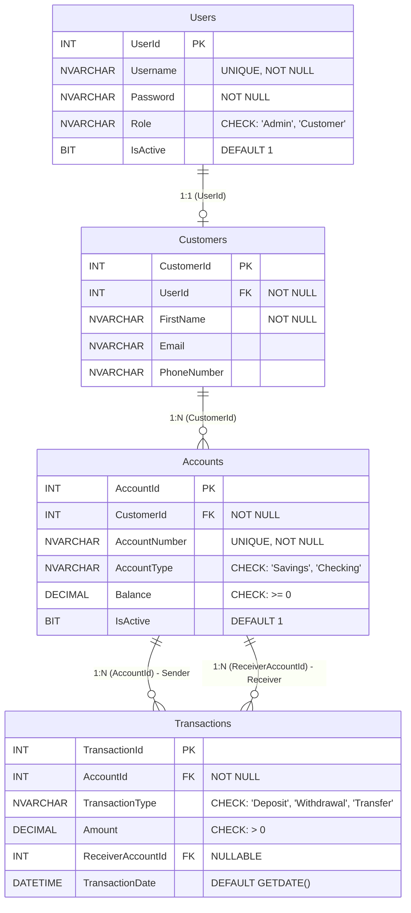

# Week 2 Task: Database Design & Implementation
**Project Name:** Banking Transaction System
**Course:** Advanced Database Management Systems (ADBMS)

## 1. Introduction
This document outlines the comprehensive database design for the **Banking Transaction System**. The database is designed to securely handle user authentication, customer profiles, account management, and transaction tracking. The implementation is done using Microsoft SQL Server and strictly adheres to robust banking constraints, data normalization, and ACID properties.

---

## 2. Entity-Relationship Diagram (ERD)

---

## 3. Database Tables & Relationships (Primary & Foreign Keys)

The database consists of 4 highly normalized tables.

### 3.1. `Users` Table
- **Purpose**: Manages system authentication, authorization, and soft-delete capabilities.
- **Primary Key**: `UserId` (IDENTITY 1,1)

### 3.2. `Customers` Table
- **Purpose**: Stores detailed profile information and contact details for customers.
- **Primary Key**: `CustomerId` (IDENTITY 1,1)
- **Foreign Key**: `UserId` references `Users(UserId)`. This is a 1:1 relationship ensuring every customer has login credentials.

### 3.3. `Accounts` Table
- **Purpose**: Stores bank account details and real-time ledger balances.
- **Primary Key**: `AccountId` (IDENTITY 1,1)
- **Foreign Key**: `CustomerId` references `Customers(CustomerId)`. This is a 1:N relationship allowing a customer to have multiple accounts.

### 3.4. `Transactions` Table
- **Purpose**: Maintains a permanent, undeletable history of all financial activities (Immutable Audit Trail).
- **Primary Key**: `TransactionId` (IDENTITY 1,1)
- **Foreign Keys**: 
  - `AccountId` references `Accounts(AccountId)` (Tracks the sender/initiator).
  - `ReceiverAccountId` references `Accounts(AccountId)` (Tracks the receiver in a Transfer).

---

## 4. Applied Constraints (NOT NULL, UNIQUE, CHECK, DEFAULT)

To ensure strict data integrity, the following constraints are actively enforced at the SQL database level:

1. **NOT NULL Constraints**:
   - Enforced on essential fields: `Users.Username`, `Users.Password`, `Customers.FirstName`, `Accounts.AccountNumber`, `Transactions.Amount`.
2. **UNIQUE Constraints**:
   - `Users.Username`: Prevents duplicate login IDs.
   - `Accounts.AccountNumber`: Ensures no two bank accounts can have the same number.
3. **CHECK Constraints**:
   - **Role Validation**: `Users.Role` must be either `'Admin'` or `'Customer'`.
   - **Account Types**: `Accounts.AccountType` must be either `'Savings'` or `'Checking'`.
   - **Transaction Types**: `Transactions.TransactionType` must be `'Deposit'`, `'Withdrawal'`, or `'Transfer'`.
   - **Financial Integrity**: `Accounts.Balance >= 0` ensures accounts cannot be overdrawn without authorization.
4. **DEFAULT Constraints**:
   - `Users.IsActive` and `Accounts.IsActive` default to `1` (True).
   - `Transactions.TransactionDate` defaults to `GETDATE()`.

---

## 5. Stored Procedures (Insert, Update, Delete)

We implemented fully transactional stored procedures to encapsulate business logic, prevent SQL injection, and guarantee data atomicity (using `BEGIN TRANSACTION` and `COMMIT`):

1. **`sp_UserLogin` (Read)**: Validates user credentials securely.
2. **`sp_CreateUser` (Insert)**: A highly complex procedure that inserts into both `Users` and `Customers` tables in a single atomic transaction.
3. **`sp_CreateAccount` (Insert)**: Generates a new bank account tied to a specific customer profile.
4. **`sp_DepositMoney` (Update/Insert)**: Updates the `Accounts` balance and simultaneously Inserts a log into `Transactions`.
5. **`sp_WithdrawMoney` (Update/Insert)**: Ensures sufficient balance exists, deducts the balance, and logs the withdrawal.
6. **`sp_TransferMoney` (Update/Insert)**: Handles transferring money from a Sender to a Receiver. It enforces strict double-entry bookkeeping by updating two different accounts and recording the exact transaction details.
7. **`sp_SoftDeleteUser` (Update)**: Instead of a dangerous hard delete, this acts as our safe "Delete" procedure by updating the `IsActive` flag to `0`, preserving audit trails.

---

## 6. Implemented Functions

The system makes use of essential built-in and logical functions to maintain state:
1. **`GETDATE()`**: Used dynamically as a default constraint and inside stored procedures to securely timestamp when transactions occur without relying on the front-end application's clock.
2. **`SCOPE_IDENTITY()`**: A critical transactional function heavily utilized within `sp_CreateUser` and `sp_CreateAccount`. It instantly captures the Primary Key generated from the previous `INSERT` statement so it can be seamlessly used as a Foreign Key in the very next `INSERT` statement within the same transaction.
3. **`ISNULL(SUM(Balance), 0)`**: An aggregation function used to calculate total bank capital dynamically.

---

## 7. Triggers for Automatic Actions

Triggers are implemented directly on the database tables to enforce strict, unbypassable security rules that fire automatically in the background:

1. **`tr_ValidateTransactionAmount` (`INSTEAD OF INSERT`)**:
   - **Logic**: Automatically intercepts any incoming transaction. If the transaction `Amount <= 0`, it instantly triggers a `ROLLBACK` and throws an error, preventing negative financial injections.
2. **`tr_PreventTransactionDeletion` (`INSTEAD OF DELETE`)**:
   - **Logic**: A critical security feature for auditing. It automatically rejects any `DELETE` queries executed against the `Transactions` table, guaranteeing that financial histories are immutable and can never be erased or tampered with by any user or administrator.
3. **`tr_UpdateAccountModifiedDate` (`AFTER UPDATE`)**:
   - **Logic**: Automatically fires whenever a bank balance changes to stamp the row with the exact time of modification for security monitoring.

---

## 8. Business Logic (Simple Explanation)

- **Registration Flow**: When an Admin creates a user, the system sets up their login (`Users`), creates their profile (`Customers`), gives them an `Account`, and records a `Deposit` for their starting balance.
- **Double-Entry Ledgers**: When transferring money, the system automatically subtracts from the sender and adds to the receiver simultaneously. If one fails, the other is rolled back instantly so money is never "lost" in the void.
- **Security & Deletion**: Financial systems never delete data. When an Admin "deletes" a customer, the system actually uses a "Soft Delete". It updates the `IsActive` column to `0`. This revokes their ability to log in and hides them from the dashboard, but keeps all their financial history permanently safely stored in the database for legal auditing.
